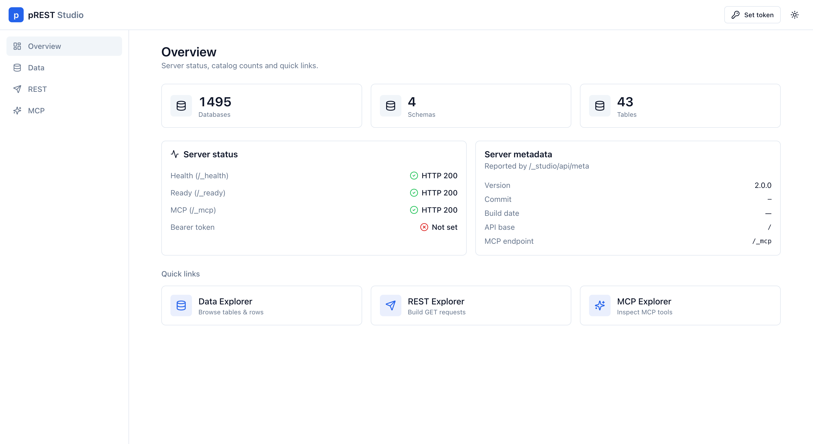
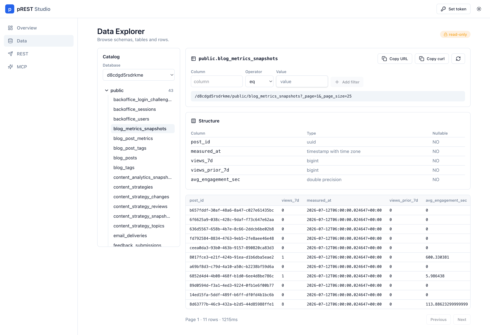
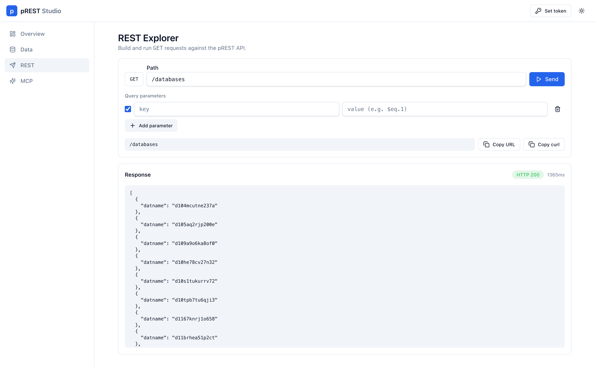
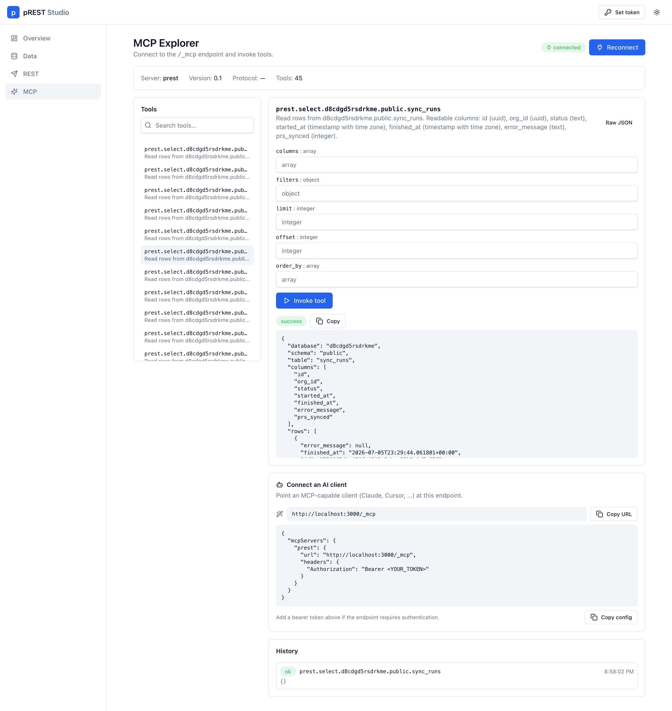

# pREST Studio

Open **pREST Studio** at `/_studio/` on the same host as your API. Studio is an embedded, read-only admin and explorer UI shipped inside the `prestd` binary (v2.2.0+) — no separate frontend process.

```text
http://localhost:3000/_studio/
```


Introduced in [v2.2.0](../releases/v2.2.0.md) ([#990](https://github.com/prest/prest/pull/990)). Enabled by default.


---

## Enable or disable

| Setting | Default | Effect |
|---------|---------|--------|
| `PREST_STUDIO_ENABLED` | `true` | Env toggle |
| `[studio] enabled` | `true` | TOML toggle |

```toml
[studio]
enabled = true
```

When disabled, `/_studio/` returns **404**.

Studio is a **same-origin** client of the existing REST and MCP APIs. It does not add a separate auth model — use **Set token** in the header for the same JWT your API expects. Bearer tokens stay in memory by default (optional per-tab `sessionStorage`). Theme toggle is in the header as well.

---

## Overview

Server status (health, ready, MCP), catalog counts, metadata from `/_studio/api/meta`, and quick links into the explorers.



---

## Data Explorer

Browse databases, schemas, and tables; inspect column structure; preview rows with filters and pagination. Marked **read-only** — copy the generated URL or `curl` when you need the same GET outside Studio.



---

## REST Explorer

Build and run GET requests against the pREST API: set the path, add query parameters, **Send**, then inspect status, timing, and body. **Copy URL** and **Copy curl** for the constructed request.



---

## MCP Explorer

Connect to `/_mcp`, search and invoke tools with generated forms (or raw JSON), review results and in-memory history, and copy a ready-made config for AI clients (Claude, Cursor, and others).



---

## MVP limits

Studio does **not** (yet): mutate data, run a SQL editor, manage migrations or ACL UI, author MCP tools, or keep server-side request history.

For writes, use REST or [custom queries](../api-reference/custom-queries.md) when your deployment allows them.

---

## Related

- [v2.2.0 release notes](../releases/v2.2.0.md)
- [MCP over HTTP](mcp-over-http.md)
- [Configuring pREST](configuring-prest.md)
- [Auth](../api-reference/auth.md)
- [API Reference](../api-reference/README.md)
- [Acronyms](../prestd/acronyms.md) · [REST](../prestd/acronyms.md#rest) · [MCP](../prestd/acronyms.md#mcp)
